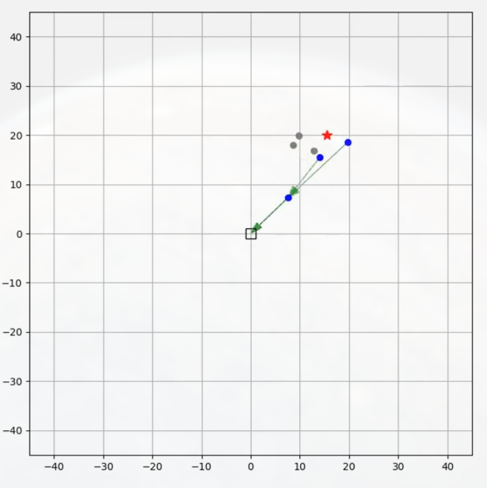
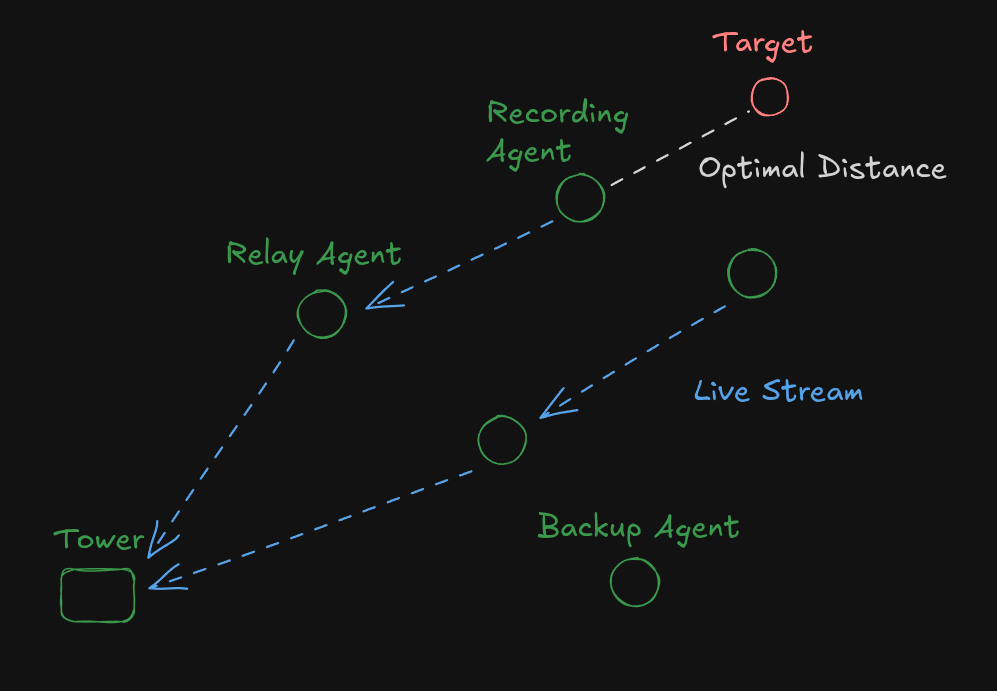
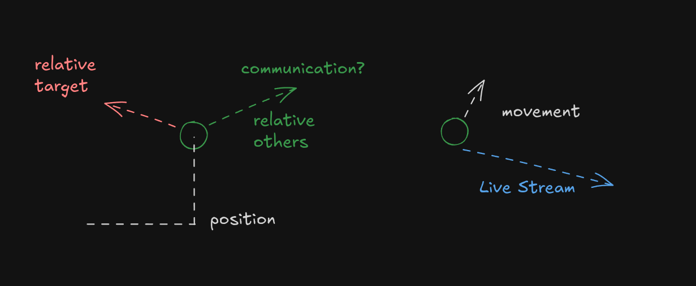

# Robust Swarm

A reinforcement learning-based agent that dynamically reallocates tasks and optimizes paths to keep drone swarms mission-cohesive, even amid electronic warfare and harsh weather.

[](videos/simulation_20250329220448.mp4)

We train the drone swarm to send multiple live streams back to the tower by means of a relay drone. Half way through we take out the communication of half of the drones to simulate a jamming attack. The swarm learns to reallocate the tasks to keep the livestream up.





## Reward Function

For each agent $i$ with position $p_i$, the reward $R_i$ is:

$$
\begin{equation}
R_i = \begin{cases}
e^{-\frac{|d_t - d_{opt}|}{5}} \cdot e^{-\frac{\|p_r - \frac{p_i}{2}\|}{5}} & \text{if streaming} \\
-1 & \text{if } \|p_i - p_j\| < 2r_c \text{ for any agent } j \neq i
\end{cases}
\end{equation}
$$

where:

- $d_t = \|p_i - p_t\|$ is the distance to target
- $d_{opt}$ is the optimal target distance
- $p_r$ is the receiver position
- $r_c$ is the collision radius

## Running Instructions

```bash
python -m venv .venv
source .venv/bin/activate
pip install -r requirements.in
python src/train.py --help
python src/replay.py --help
```

If the gpu cannot be found on, you may need to reinstall torch with the right version of cuda for example if you have cuda 12.1 installed, you can run:

```bash
pip install --upgrade --force-reinstall torch torchvision torchaudio --index-url https://download.pytorch.org/whl/cu121 --user
```
